# 🍲 Flutter Recipe App (Firebase & Provider)

[](https://flutter.dev)
[](https://dart.dev)
[](https://firebase.google.com)
[](https://pub.dev/packages/provider)
[](LICENSE)

A modern, responsive, and feature-rich **Flutter Recipe Application** built with **Cloud Firestore** and **Provider** state management. 

This application was developed as a complete, faithful replica and architectural enhancement of the tutorial:
📺 **[Complete Flutter App Using Flutter Firebase and Provider - Recipe App](https://www.youtube.com/watch?v=JdVu04EC7kE)**.

While the original tutorial covered fundamental UI and basic favorites, this repository goes several steps further by delivering a production-grade culinary companion packed with advanced features such as an **interactive step-by-step cooking mode with a live countdown timer**, a **7-day weekly meal planner with daily calorie tracking**, an **instant real-time recipe search engine**, and a **customizable settings and culinary preferences panel**.

---

## 📱 App Walkthrough & Visual Tour

Explore the complete feature set and user journey across this Flutter Recipe App:

### 🏠 Discovery & Category Browsing
| Home Screen | Breakfast Category | Lunch Category | Dinner Category |
| :---: | :---: | :---: | :---: |
| 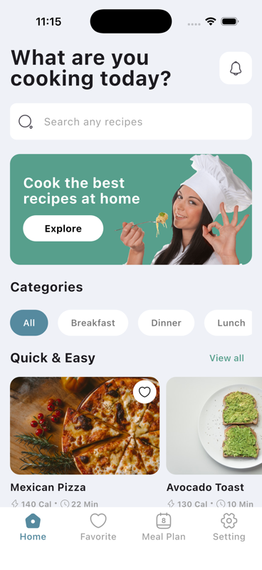<br><sub><b>Home Screen</b><br>Auto-scrolling banner carousel, category pills & trending recipe cards</sub> | 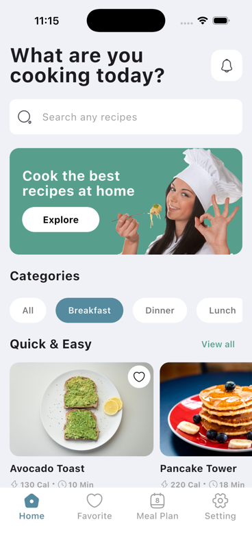<br><sub><b>Breakfast Filter</b><br>Instant category filtering showing morning meal options & calorie stats</sub> | 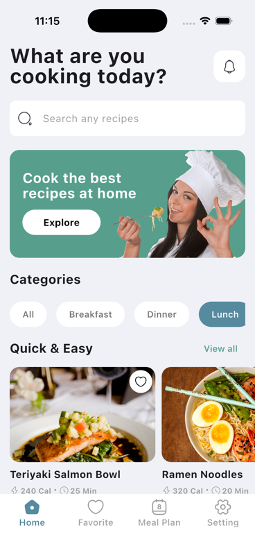<br><sub><b>Lunch Filter</b><br>Midday delights with review counts, star ratings, and cook times</sub> | 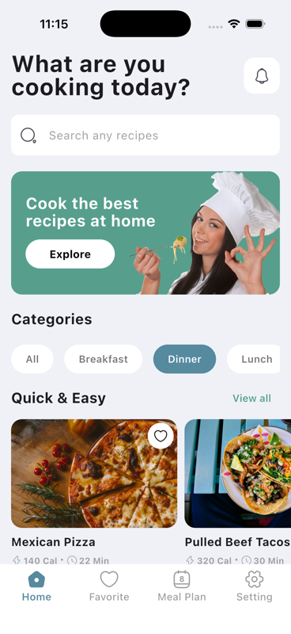<br><sub><b>Dinner Filter</b><br>Hearty evening meals filtered in real-time with responsive layout</sub> |

### 🔍 Catalog & Live Search Engine
| Full Recipe Catalog | Search Overview | Live Keyword Search | Recipe Detail |
| :---: | :---: | :---: | :---: |
| 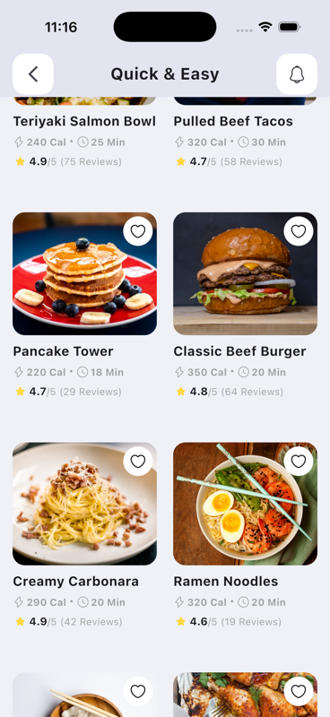<br><sub><b>Catalog Grid ("View All")</b><br>Two-column responsive grid with quick category filter chips</sub> | 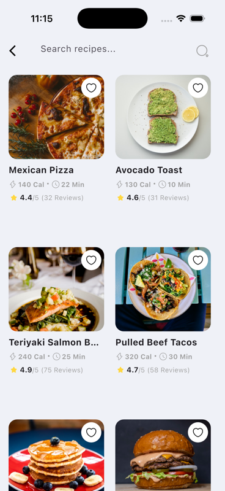<br><sub><b>Search Hub</b><br>Instant search interface with suggested popular craving tags</sub> | 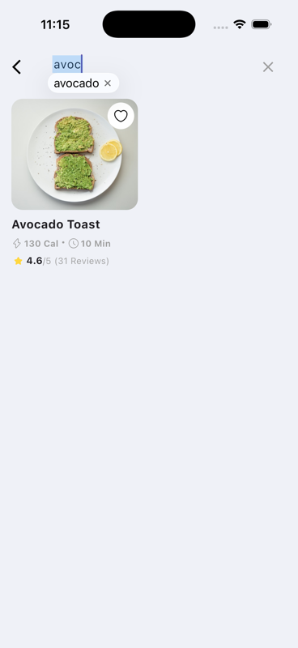<br><sub><b>Live Search Results</b><br>Real-time fuzzy search as you type (e.g. "avoc" matching avocado salad)</sub> | 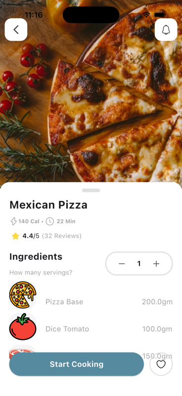<br><sub><b>Recipe Detail (1 Serving)</b><br>Hero photography, nutritional stats, ingredients list & instruction tabs</sub> |

### 🍳 Interactive Cooking & Scaling
| Dynamic Servings Multiplier | Add to Favorites | Step-by-Step Cooking Mode | Saved Favorites |
| :---: | :---: | :---: | :---: |
| <br><sub><b>Dynamic Scaling (6 Servings)</b><br>Reactive mathematical scaling of all ingredient amounts in real-time</sub> | 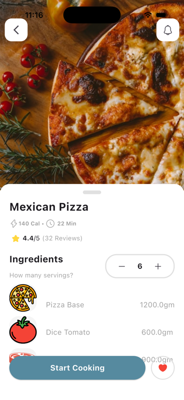<br><sub><b>Instant Bookmarking</b><br>One-tap heart toggle with snackbar alert & Cloud Firestore synchronization</sub> | 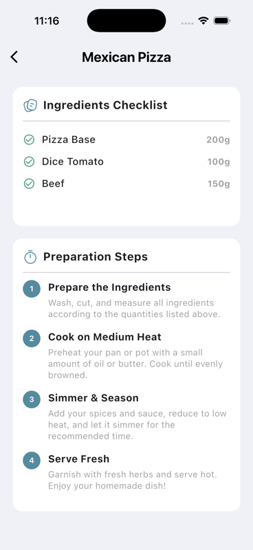<br><sub><b>Interactive Cooking Mode</b><br>Hands-on checklist walkthrough with built-in live countdown timer</sub> | 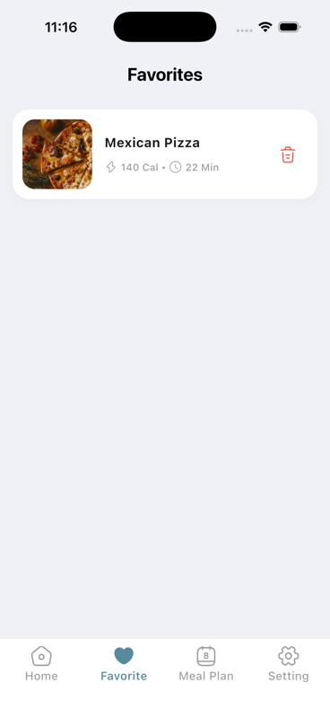<br><sub><b>Favorites Screen</b><br>Persistent collection of saved recipes with live stream & one-tap removal</sub> |

### 📅 Planning, Notifications & Settings
| Weekly Meal Planner | Notification Center | User Settings & Preferences | Open Source Licenses |
| :---: | :---: | :---: | :---: |
| 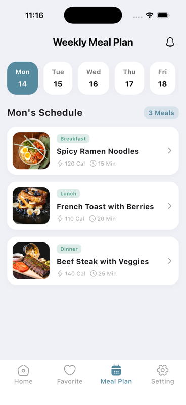<br><sub><b>Weekly Meal Planner</b><br>7-day schedule with meal slots (Breakfast, Lunch, Dinner) & calorie totals</sub> | 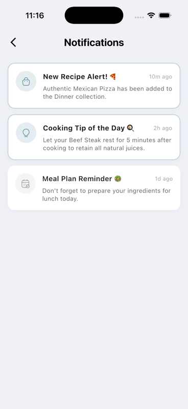<br><sub><b>Notification Center</b><br>Daily culinary tips, meal reminders, announcements & unread badges</sub> | 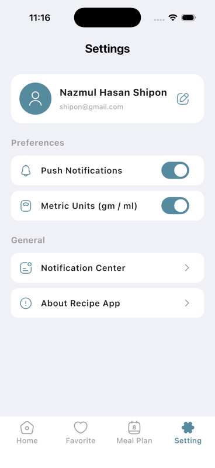<br><sub><b>User Profile & Settings</b><br>Culinary preferences, units toggle (Metric/Imperial) & image cache manager</sub> | 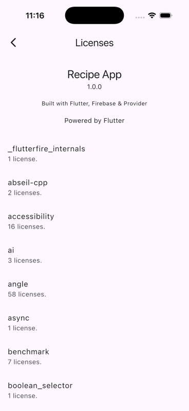<br><sub><b>License Attribution</b><br>Comprehensive open-source software license registry powered by Flutter</sub> |

---

## 🚀 Key Features & Overview

### 1. 🏠 Explore & Discover (Home Screen)
- **Auto-Scrolling Banner Carousel**: Dynamic promotional slider highlighting trending recipes and chef specials with smooth animated page indicators and touch gesture support.
- **Category Filter Pills**: Filter recipes seamlessly across Breakfast, Lunch, Dinner, Dessert, and Fast Food categories with instant visual feedback.
- **Responsive Recipe Cards**: Custom card components showing high-resolution food thumbnails, review counts, star ratings, calorie badges, and preparation times.
- **Quick-Access "View All"**: Dedicated catalog screen allowing users to browse recipes with category chips and a two-column responsive grid layout.

### 2. 📖 Recipe Details & Dynamic Ingredient Calculator
- **Hero Image Header**: Full-bleed imagery with smooth back navigation and real-time favorite toggling.
- **Interactive Servings Multiplier**: Powered by `QuantityProvider`, users can increase or decrease servings with instant, reactive mathematical scaling of ingredient quantities.
- **Tabbed Experience**: Clean segmented views for **Ingredients** (with thumbnail, title, and quantity in grams) and **Preparation Instructions**.
- **Interactive Cooking Mode Entrypoint**: Direct CTA to launch into guided hands-on cooking.

### 3. 👨‍🍳 Guided Cooking Steps Mode (*Beyond Tutorial*)
- **Step-by-Step Checklist**: Interactive recipe walkthrough allowing home cooks to check off steps as they complete each technique.
- **Built-in Cooking Countdown Timer**: Start, pause, and reset timer directly in the app so food is never overcooked.
- **Live Progress Tracking**: Visual progress bar indicating completion percentage.
- **Celebration Modal**: Rewarding completion dialog when the dish is ready to serve.

### 4. 📅 7-Day Weekly Meal Planner (*Beyond Tutorial*)
- **Day-by-Day Selector**: Easy navigation between Monday through Sunday.
- **Meal Slot Organization**: Categorized schedule for **Breakfast**, **Lunch**, **Dinner**, and **Snacks**.
- **Daily Calorie Summaries**: Automated aggregation of calories planned for each day to support dietary goals.
- **Preparation Tracking**: Toggle meal status as prepared or adjust upcoming meals effortlessly.

### 5. 🔍 Real-Time Recipe Search (*Beyond Tutorial*)
- **Instant Live Filtering**: As-you-type search matching recipe titles, ingredients, and categories.
- **Quick Category Tags**: One-tap query tags for popular cravings (e.g., Avocado, Chicken, Salad, Pasta).
- **Empty States**: Friendly illustrated fallbacks when no recipes match query criteria.

### 6. ❤️ Real-Time Favorites System
- **Cloud Firestore Synchronization**: User favorite status is synced directly to the `userFavorites` collection in Firestore.
- **Persistent State**: Favorites remain synchronized across app sessions and device restarts.
- **Dedicated Favorites Screen**: Quick access to all bookmarked recipes with instant removal and empty state illustrations.

### 7. 🔔 Notification Center (*Beyond Tutorial*)
- **Culinary Alerts**: Reminders for planned meals, chef tips of the day, and seasonal recipe announcements.
- **Unread Status Badges**: Visual indicator for unread notifications and one-tap "Mark all as read".

### 8. ⚙️ Profile & Custom Settings (*Beyond Tutorial*)
- **Culinary Profile**: Customized user card displaying profile name (**Nazmul Hasan Shipon**) and cooking level.
- **Dietary Preferences**: Options for Vegetarian, Vegan, Gluten-Free, and Keto lifestyles.
- **Measurement Units**: Instant toggle between **Metric (g/ml)** and **US Imperial (oz/cups)**.
- **Cache & Storage Management**: Clear cached recipe images with a single tap.

---

## 📊 Comparison: Original Tutorial vs. This Enhanced Replica

| Feature / Capability | YouTube Tutorial | This Repository |
| :--- | :---: | :---: |
| **Home Screen & Category Filtering** | ✅ Basic | ✅ **Enhanced with smooth animations & shadow tokens** |
| **Promotional Banner** | ⚠️ Static Single Banner | ✅ **Auto-Scrolling Carousel with dot indicators** |
| **Recipe Detail Screen** | ✅ Yes | ✅ **Polished hero header + nutritional stats** |
| **Dynamic Servings / Ingredient Multiplier** | ✅ Basic Provider | ✅ **Clamped QuantityProvider with unit tests** |
| **Cloud Firestore Backend** | ✅ Yes | ✅ **Integrated with automated data seeder** |
| **Automated Data Seeder** | ❌ Manual Firestore entry | ✅ **`FirebaseDataSeeder` for one-tap bootstrapping** |
| **Interactive Step-by-Step Cooking Mode** | ❌ Not implemented | ✅ **`CookingStepsScreen` with checklist & live timer** |
| **Weekly Meal Planner (7-Day Calendar)** | ❌ Empty tab | ✅ **`MealPlanScreen` with slots & calorie counter** |
| **Instant Live Search Engine** | ❌ Static search bar | ✅ **`RecipeSearchScreen` with real-time query filter** |
| **Notification Center** | ❌ Not implemented | ✅ **`NotificationsScreen` with unread badges & alerts** |
| **Profile & Settings Screen** | ❌ Empty tab | ✅ **`SettingScreen` with dietary preferences & unit toggle** |
| **Modern Flutter 3.x Styling** | ⚠️ Deprecated `.withOpacity` | ✅ **Migrated to `Color.withValues(alpha: ...)`** |
| **Unit Testing Suite** | ❌ None | ✅ **`QuantityProvider` servings & scaling tests** |

---

## 🏗️ Architecture & Data Flow

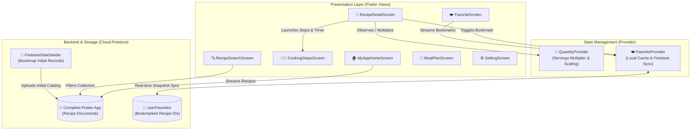

---

## 📂 Project Structure

The project follows a clean, modular structure separating presentation, state providers, utilities, and assets:

```
lib/
├── Model/
│   └── recipe_model.dart            # Recipe domain model & Firestore parser
├── Provider/
│   ├── favorite_provider.dart       # Favorites state & Firestore sync
│   └── quantity.dart                # Servings multiplier & ingredient scaling
├── Utils/
│   ├── constants.dart               # Colors, typography, and theme tokens
│   └── firebase_data_seeder.dart    # Automated Firestore database populator
├── Views/
│   ├── app_main_screen.dart         # BottomNavigationBar root scaffold
│   ├── cooking_steps_screen.dart    # Guided cooking mode with timer
│   ├── favorite_screen.dart         # Favorites screen with real-time stream
│   ├── meal_plan_screen.dart        # Weekly meal planner & calorie tracker
│   ├── my_app_home_screen.dart      # Main dashboard & recipe discovery
│   ├── notifications_screen.dart    # Notification center & alerts
│   ├── recipe_detail_screen.dart    # Detailed recipe view & servings scaler
│   ├── recipe_search_screen.dart    # Real-time search screen
│   ├── setting_screen.dart          # User profile & culinary preferences
│   └── view_all_items.dart          # Full recipe catalog grid
├── Widget/
│   ├── banner.dart                  # Static banner card
│   ├── banner_slider.dart           # Auto-scrolling carousel with dot indicators
│   ├── custom_network_image.dart    # Resilient image loader with error fallbacks
│   ├── food_items_display.dart      # Recipe card with heart favorite toggle
│   ├── my_icon_button.dart          # Circular icon button
│   └── quantity_increment_decrement.dart # Servings counter controller
└── main.dart                        # Firebase init, MultiProvider, & App root
```

---

## 🛠️ Tech Stack & Dependencies

- **Framework**: [Flutter 3.x](https://flutter.dev) (Channel stable)
- **Language**: [Dart 3.x](https://dart.dev)
- **Backend / Database**: [Cloud Firestore](https://firebase.google.com/docs/firestore) (`cloud_firestore: ^6.9.0`)
- **Firebase Core**: `firebase_core: ^4.14.0`
- **State Management**: [Provider](https://pub.dev/packages/provider) (`provider: ^6.1.5+1`)
- **Iconography**: [Iconsax](https://pub.dev/packages/iconsax) (`iconsax: ^0.0.8`) & Cupertino Icons
- **Code Quality**: `flutter_lints: ^6.0.0`

---

## 🚀 Getting Started

### 1. Prerequisites
- [Flutter SDK](https://docs.flutter.dev/get-started/install) (v3.13.0 or higher)
- Android Studio / Xcode for device emulators
- A Firebase project with Cloud Firestore enabled

### 2. Clone the Repository
```bash
git clone https://github.com/iamnazmulhasan/recipe-app.git
cd recipe-app
```

### 3. Install Dependencies
```bash
flutter pub get
```

### 4. Firebase Configuration
Generate your `firebase_options.dart` using the FlutterFire CLI:
```bash
flutterfire configure
```

*(Optional)* To automatically populate Firestore with the sample recipes and categories:
1. Uncomment `await FirebaseDataSeeder.seedInitialData();` in `lib/main.dart`.
2. Run the application once.
3. Re-comment the line to prevent duplicate uploads on subsequent hot restarts.

### 5. Run the Application
```bash
# Run on connected iOS Simulator or Android Emulator
flutter run
```

---

## 🧪 Running Unit Tests

Execute the unit test suite to verify servings calculation and ingredient scaling:
```bash
flutter test
```

---

## 📄 License

This project is licensed under the MIT License - see the [LICENSE](LICENSE) file for details.

---

## 👨‍💻 Author

**Nazmul Hasan Shipon**  
GitHub: [@iamnazmulhasan](https://github.com/iamnazmulhasan)  
Email: [nazmulhasan.shipon@outlook.com](mailto:nazmulhasan.shipon@outlook.com)
